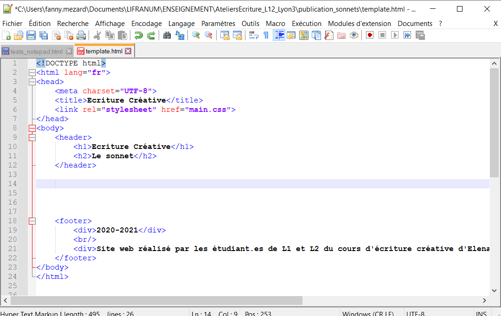
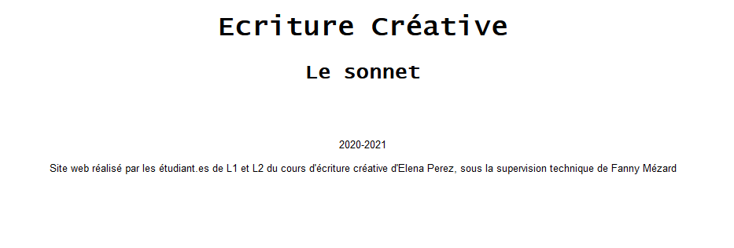

# Publication en ligne de sonnets 

Ce tutoriel vise à mettre en ligne des sonnets produits par des étudiant.es de L1 et L2 du cours d'Ecriture Créative. 

## Mise en place 

- Créez un dossier `nom_etudiante` sur le bureau
- Enregistrer le fichier `main.css` et le fichier `template.html` dans le dossier `nom_etudiante`
- Cherchez `notepad++` dans la barre de recherche de votre ordinateur et lancez ce programme. 
- Faites `fichier` → `ouvrir un fichier` et sélectionnez `template.html
- Faites `fichier` → `enregistrer sous` et nommez le fichier `nom_de_famille.html` (Ce nom apparaitre sur le site web, qui sera mis en ligne, si vous tenez à rester anonyme vous pouvez utiliser un pseudonyme). **Le nom de fichier ne doit comprendre ni espace ni caractère spéciaux, ni accents** 
Vous devriez maintenant avoir quelque chose comme ça :

C'est dans ce fichier que vous allez insérer votre poème entre la partie `header` et la partie `footer`.

Ouvrez un navigateur (de préférence firefox) et tapez `ctrl-o` - cette commande permet d'ouvrir un fichier présent sur votre ordinateur. Choisissez le fichier `nom_de_famille.html`. Vous devez voir apparaitre cette page dans votre navigateur : 

 Lorsque vous faites une modification (ex : ajouter le texte de votre sonnet), vous pouvez voir le résultat dans le navigateur en rafraichissant la page (`ctrl-R`). Pour que le résultat apparaissent, il faut bien penser à **sauvegarder** votre travail (`ctrl-S`). 

## Encodage du sonnet 
*La partie "mise en page" a déjà été codée, vous pouvez vous y référer, c'est le fichier `main.css`, si vous le supprimez ou s'il est dans un dossier différent, vous verrez le HTML brut. C'est pour cela que les balises à utiliser sont imposée : si vous utilisez des noms de balises différents, la mise en page en sera affectée. *

Créez la structure du document : 
- 2 sections, l'une doit avoir pour classe `introduction`et l'autre `sonnet`exemple : `<section class='introduction'>texte de l'introduction</section>`
- Dans la section "introduction" : le texte de votre introduction
- `settings` → `preferences` → `auto-completion` → `html/xml close tags`
- Dans la section "sonnet" : 
    - Une balise `h3`avec le titre du sonnet
    - Une balise ayant pour classe `auteur` avec le nom de l'auteur ou de l'autrice (si vous tenez à rester anonyme, utilisez un pseudonyme, celui-ci devra être le même que celui utilisé comme nom de fichier.
- Les quatrain doivent être dans des balise `div` avec pour classe `quatrain`
- Les tercets doivent être dans des balises `div` avec pour classe `tercet`
- Chaque vers doit être dans une `div` avec pour classe `vers`

## Ajouts de notes 
Il est possible d'ajouter des notes à votre sonnet, les mots porteurs de la notes apparaitront en rouge et le contenu de la note apparaitra dans la marge à droite lorsque l'on passera la souris sur les mots concernés. Pour encoder la note il faut encoder les mots qui doivent apparaitre en rouge ainsi que le contenu de la note. Les mots du poèmes doivent être dans une balise `span` avec un id `note1` (puis `note2` et `note3`). Ils doivent être directement suivis d'une balise `span`avec pour attribut `note1_contenu`. Le fichier css ne peut gérer que 3 notes en l'état.  

## Ajouts de liens 
Il est possible de rajouter des liens cliquables dans votre poème ou dans l'introduction afin de faire des renvois vers des sites externes. Vous pourriez par exemple ajouter un lien vers sonnet qui vous a inspiré dans votre introduction. Pour cela, on utilise la balise `a` en mettant l'url du lien dans l'attribut `href` : `<a href="www.wikipedia.fr">Cliquez ici pour aller sur wikipedia</a>` Le texte entre les balises sera cliquable et renverra vers le site dont l'URL est donnée en attribut. 

## Bonus : découvrir le CSS 

Si vous avez ajouté tout le contenu, ajouté au moins un lien et une note, vous pouvez découvrir le CSS. 

Ouvrez le fichier HTML dans le navigateur puis faites un clique doit et sélectionnez `inspecter` → `éditeur de style`. Vous pouvez modifier des éléments et voir le résultat immédiatement. Vous pouvez déjà essayer de changer les noms des couleurs pour visualisez quels éléments correspondent à quoi. 

Voici un tutoriel très clair si vous avez envie d'aller plus loin : https://openclassrooms.com/fr/courses/1603881-apprenez-a-creer-votre-site-web-avec-html5-et-css3/1605060-mettez-en-place-le-css

## Enregistrement et envoie des résultats
- Enregistrez votre travail (bien nommez les fichiers avec votre nom de famille svp !!). Si vous avez modifié le fichier CSS, merci de me l'envoyer, il doit être renommé avec le même nom que le fichier HTML, mais avec l'extenions css : `nom_de_famille.css`
- Envoyez les fichiers par mail à `fanny.mezard@univ-lyon3.fr` avec Ecriture Créative et le numéro du groupe, au plus tard 48h après le TD. 
- Je mettre les fichiers en ligne à cette adresse : https://fmezard.github.io/publication_sonnets/

